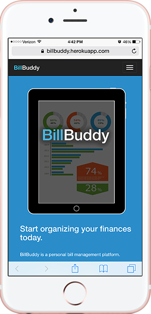
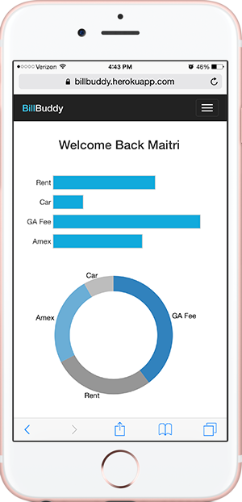

# BillBuddy

BillBuddy is a Ruby on Rails web application that allows users to keep track of all of their expenses in one place.

### User Stories
- As a user, I want to log in and see my list of expenses so I can stay on top of my finances.
- As a user, I want to be able to add new bills and remove paid bills so my list is up-to-date.

- Responsive and optimized for desktop and mobile
- Ruby on Rails application
- D3.js to render graphical data
- Backbone.js to render expense lists
- PostgreSQL database to store user inputs
- Bootstrap framework for styling
